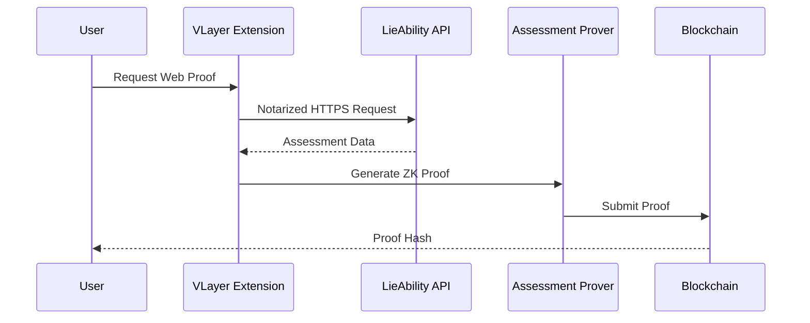

# VLayer Web Proofs Integration in LieAbility

## Overview

LieAbility now integrates **VLayer Web Proofs** to provide cryptographic verification of AI assessment scores using **zkTLS (Zero-Knowledge Transport Layer Security)**. This ensures that trust scores are authentic, tamper-proof, and generated by legitimate AI analysis while maintaining privacy.

## What are VLayer Web Proofs?

VLayer Web Proofs use zkTLS technology to create cryptographic proofs of web API responses. This allows users to prove that their assessment data came from the legitimate LieAbility backend without exposing sensitive biometric information or allowing tampering.

### Key Benefits

- **🔒 Privacy-Preserving**: Proves authenticity without revealing sensitive biometric data
- **🛡️ Tamper-Proof**: Cryptographically proves data hasn't been modified
- **⚡ Trustless**: No need to trust centralized authorities
- **🔗 Blockchain-Verified**: Proofs are verified on-chain for transparency
- **🌐 Interoperable**: Works across different platforms and applications

## Architecture

### Components

1. **AssessmentProver Contract** (`contracts/AssessmentProver.sol`)

   - Runs off-chain in VLayer's zkEVM
   - Verifies Web Proofs from LieAbility API
   - Extracts and validates assessment data
   - Generates ZK proofs of authenticity

2. **LieAbilityVerifier Contract** (`contracts/LieAbilityVerifier.sol`)

   - Runs on-chain (Ethereum/Sepolia)
   - Verifies proofs from AssessmentProver
   - Stores verified assessments
   - Prevents proof replay attacks

3. **VLayerService** (`frontend/src/services/VLayerService.ts`)

   - Frontend service for generating Web Proofs
   - Integrates with VLayer browser extension
   - Handles proof submission and verification

4. **API Endpoint** (`backend/server.js`)
   - Provides verifiable assessment data
   - Returns structured JSON for proof generation
   - Includes cryptographic integrity checks

## How It Works

### 1. Web Proof Generation Flow



### 2. Verification Process

1. **API Call Notarization**: VLayer extension captures HTTPS traffic to LieAbility API
2. **Data Extraction**: Prover contract extracts assessment scores from API response
3. **Proof Generation**: ZK proof generated proving data authenticity
4. **On-Chain Verification**: Verifier contract validates proof and stores result
5. **Certificate Generation**: User can generate NFT certificate based on verified score

## Implementation Details

### Frontend Integration

```typescript
import { vlayerService } from "@/services/VLayerService";

// Generate Web Proof for user assessment
const proof = await vlayerService.generateAssessmentProof(userAddress);

// Verify proof on-chain
const isVerified = await vlayerService.verifyProofOnChain(
  proof,
  VERIFIER_CONTRACT_ADDRESS
);
```

### Smart Contract Deployment

The contracts use VLayer's Solidity library:

```solidity
import "@vlayer/solidity/WebProof.sol";
import "@vlayer/solidity/Proof.sol";

// AssessmentProver.sol - Runs off-chain
function proveAssessment(
    WebProof calldata webProof,
    address userAddress
) public returns (AssessmentData memory) {
    // Verify web proof and extract data
    webProof.verify("your-domain.com");
    // ... proof logic
}

// LieAbilityVerifier.sol - Runs on-chain
function verifyAssessment(Proof calldata proof) external {
    AssessmentData memory data = proof.verifyWith(assessmentProver);
    // ... verification logic
}
```

### API Endpoint Structure

```javascript
// Backend endpoint that VLayer will verify
app.get("/api/assessment", async (req, res) => {
  const { address } = req.query;

  // Return verifiable assessment data
  res.json({
    success: true,
    data: {
      userAddress: address,
      trustScore: 87,
      timestamp: Math.floor(Date.now() / 1000),
      assessmentId: `assess_${Date.now()}`,
      breakdown: {
        facial: 85,
        speech: 90,
        // ... other scores
      },
    },
  });
});
```

## Security Features

### 1. Proof Replay Prevention

- Each proof can only be used once
- Proof hashes are tracked on-chain
- Prevents duplicate submissions

### 2. Data Integrity

- Cryptographic verification of API responses
- Tamper-proof assessment scores
- Verifiable timestamps

### 3. Privacy Protection

- Sensitive biometric data never exposed
- Only final scores are proven
- Zero-knowledge proof system

### 4. Trustless Verification

- No reliance on centralized authorities
- Blockchain-based verification
- Public auditability

## Deployment Instructions

### 1. Install Dependencies

```bash
cd frontend
npm install @vlayer/sdk --legacy-peer-deps
```

### 2. Deploy Contracts

```bash
# Deploy AssessmentProver (off-chain)
vlayer deploy AssessmentProver.sol --network testnet

# Deploy LieAbilityVerifier (on-chain)
forge create LieAbilityVerifier --constructor-args <PROVER_ADDRESS>
```

### 3. Configure Frontend

```typescript
// Update environment variables
VITE_PROVER_CONTRACT_ADDRESS=0x...
VITE_VERIFIER_CONTRACT_ADDRESS=0x...
VITE_NETWORK=sepolia
```

### 4. Set Up VLayer Extension

1. Install VLayer browser extension
2. Configure for testnet/mainnet
3. Connect to your application

## Testing

### Local Development

```bash
# Start backend
npm run dev

# Start frontend
cd frontend && npm run dev

# Test Web Proof generation
npm run test:vlayer
```

### Web Proof Testing

The current implementation includes a mock mode for development:

```typescript
// For testing without browser extension
const proof = await vlayerService.generateAssessmentProof(userAddress);

// For production with real extension
const hash = await vlayerService.generateRealWebProof(
  userAddress,
  PROVER_CONTRACT_ADDRESS,
  proverABI
);
```

## Production Considerations

### 1. Browser Extension Requirement

- Users must install VLayer browser extension
- Currently supports Chrome and Brave
- Extension guides user through proof generation

### 2. Network Configuration

- Testnet: Use VLayer's test notary and proxy
- Mainnet: Consider running your own notary
- WebSocket proxy may need custom setup for your domain

### 3. Gas Costs

- Proof verification costs gas
- Consider gas optimization strategies
- Batch multiple verifications if possible

### 4. User Experience

- Clear instructions for extension installation
- Progressive disclosure of proof benefits
- Fallback modes for users without extension

## Example Use Cases

### 1. Employment Verification

```typescript
// Employer verifies candidate authenticity
const isAuthentic = await verifierContract.isUserVerified(candidateAddress);
```

### 2. Insurance Risk Assessment

```typescript
// Insurance provider checks truthfulness scores
const assessment = await verifierContract.getVerificationStatus(userAddress);
if (assessment.trustScore >= 85) {
  // Offer premium rates
}
```

### 3. Dating App Verification

```typescript
// Dating platform verifies user authenticity
const verified = await vlayerService.getProofStatus(userProofHash);
```

## Troubleshooting

### Common Issues

1. **Extension Not Opening**

   - Ensure VLayer extension is installed and enabled
   - Check popup blockers
   - Verify network configuration

2. **Proof Generation Fails**

   - Check API endpoint accessibility
   - Verify WebSocket proxy setup
   - Ensure notary server is reachable

3. **Contract Verification Fails**
   - Check contract addresses are correct
   - Verify proof format matches expected structure
   - Ensure sufficient gas for transaction

### Support Resources

- [VLayer Documentation](https://book.vlayer.xyz)
- [Discord Support](https://discord.gg/vlayer)
- [GitHub Issues](https://github.com/vlayer-xyz/vlayer)

## Future Enhancements

1. **Multi-API Proofs**: Prove assessment scores from multiple sources
2. **Batch Verification**: Verify multiple assessments in single transaction
3. **Cross-Chain Support**: Deploy verifiers on multiple chains
4. **Advanced Privacy**: Selective disclosure of specific score components
5. **Decentralized Notaries**: Reduce dependence on centralized infrastructure

## Conclusion

VLayer Web Proofs provide a powerful foundation for trustless verification of LieAbility assessment scores. This integration ensures that authenticity certificates are backed by cryptographic proof, making them valuable for employment, insurance, dating, and other trust-critical applications.

The system maintains privacy while providing verifiable authenticity, opening new possibilities for how truthfulness assessments can be used in decentralized applications and real-world scenarios.
